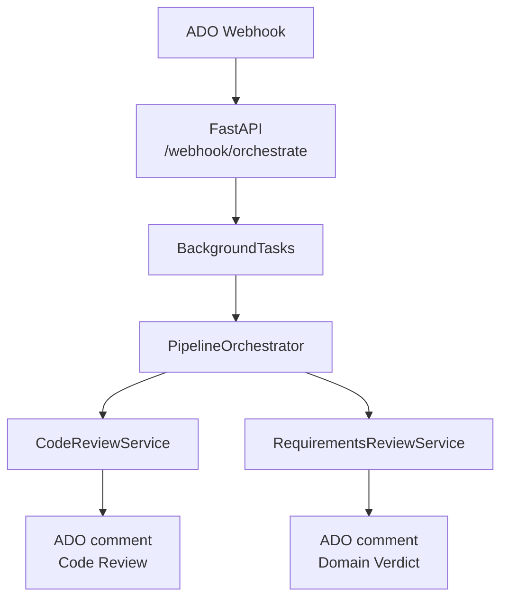

# ScopeReview AI

> **Dual-agent, privacy-first Pull Request automation** for **Azure DevOps**: deterministic static checks + LLM code
> review, then requirements validation against Work Items — with **hexagonal architecture**, **optional Redis
deduplication**, and **domain-enforced verdicts**.

Developed at **DevScope** / **ISEP** (internship 2025/2026).

---

## What it does (one minute)

1. **Azure DevOps** sends a **Service Hook** when a PR is created or updated (`git.pullrequest.*`).
2. **FastAPI** accepts the payload, validates size / optional **Basic auth**, returns **202 Accepted** immediately, and
   schedules a **background pipeline**.
3. **Pipeline** fetches PR + files + Work Items from ADO REST **v7.1**.
4. **Code Review Agent** runs **guided by pre-loaded Requirements** + **Polyglot Static Analyzer** + **LLM** on diffs →
   posts a **Markdown** thread.
5. **Requirements Agent** runs **LLM** over **raw compressed source files** + AC + rules + injected CR findings → *
   *parses JSON** (
   with **`json-repair` fallback**) → **normalises verdict** with **pure Python domain rules** → posts a second thread.



---

## Agents (application services)

| Agent            | Code                               | Models (configurable)                  | Output                                   |
|------------------|------------------------------------|----------------------------------------|------------------------------------------|
| **Code Review**  | `src.services.code_review`         | `AZURE_MODEL_CR` (e.g. o4-mini)        | Findings, score, approve gate            |
| **Requirements** | `src.services.requirements_review` | `AZURE_MODEL_REQ` (e.g. DeepSeek-V3.2) | Per-requirement status + overall verdict |

Orchestration: **`PipelineOrchestrator`** in `src.services.orchestrator`. Wiring: **`src.composition`** and *
*`src.bootstrap`**.

> **Models are fully configurable** via `AZURE_MODEL_CR` and `AZURE_MODEL_REQ` environment variables — replace with your
> preferred endpoints anytime.

---

## Engineering highlights

| Feature                          | Detail                                                                                                                                                                               |
|----------------------------------|--------------------------------------------------------------------------------------------------------------------------------------------------------------------------------------|
| **Hexagonal / ports**            | `AIModelClientPort`, `AzureDevOpsClientPort`, `PipelineDedupPort` in `src/ports/`                                                                                                    |
| **Bootstrap**                    | `src/bootstrap.py`: Initialisation logic that wires adapters to ports and registers them in the DI container.                                                                        |
| **Dependency Injection (DI)**    | Pattern used to decouple high-level services from low-level adapters via a central registry (`core.di`).                                                                             |
| **Deduplication**                | TTL guard so the same PR is not processed twice in a short window: **Redis** `SET NX EX` when `DEDUP_REDIS_URL` is set (multi-replica), else **in-process** `InMemoryPipelineDedup`. |
| **Semantic Triage Gate**         | `core/triage.py` — classifies files as `SKIP/LIGHT/FULL` before any LLM call. Documents, lock files, and assets are discarded entirely.                                              |
| **Cross-Agent Knowledge Ledger** | `core/knowledge_ledger.py` — maps CR findings to NFR categories; pre-verified facts injected into Requirements Agent to eliminate duplicated analysis.                               |
| **AC-Aware Context Pruning**     | `core/ast_skeleton.py` — extracts business terms from Acceptance Criteria and compresses source code to domain-critical lines (~45% token reduction, domain self-configuring).       |
| **Circuit Breaker**              | If Phase 1 exhausts `MAX_TOKEN_BUDGET`, Phase 2 is skipped entirely — protecting cost and latency.                                                                                   |
| **Domain policy**                | `src/domain/requirements_verdict.py` — **canonical verdict enforcement** (MUST gate is absolute); LLM output may be overridden                                                       |
| **Verdict normalization**        | LLM output → `json-repair` → Pydantic validation → **domain rules** → final authoritative verdict (see [Architecture](./Architecture.md))                                            |
| **JSON resilience**              | `src/core/llm_json.py` — sanitize + `json-repair` + configurable `REQUIREMENTS_MAX_COMPLETION_TOKENS`                                                                                |
| **Config**                       | `validate_settings()` on **app lifespan** (not import time); `ENVIRONMENT=dev` for dev mode; `SCOPE_REVIEW_ALLOW_HTTP_AI=1` for local HTTP mocks only                                |
| **Security**                     | Webhook errors do not leak secrets; PAT / keys via env only; no data sent to third-party SaaS                                                                                        |

---

## Stack

| Layer             | Technology                                            |
|-------------------|-------------------------------------------------------|
| Runtime           | Python **3.14**, **FastAPI**, **Uvicorn**             |
| Integrations      | **requests** → ADO REST, Azure OpenAI-compatible chat |
| Data validation   | **Pydantic v2**                                       |
| Dedupe (optional) | **Redis** 7 (`redis` PyPI)                            |
| JSON repair       | **json-repair**                                       |
| Containers        | **Docker Compose** (`agent` + `redis`)                |

---

## Repository layout

### Application repo (`poc-code-review`)

```text
src/
  main.py              # FastAPI + global exception handler
  bootstrap.py         # Dependency bootstrap and initialization
  composition.py       # Composition root (entrypoint to DI)
  api/webhooks.py      # POST /webhook/orchestrate (validated)
  core/di.py           # Custom lightweight DI container
  core/triage.py       # Semantic Triage Gate (SKIP/LIGHT/FULL)
  core/knowledge_ledger.py  # Cross-Agent Knowledge Ledger (NFR dedup)
  core/ast_skeleton.py      # AC-Aware Context Pruning (code compression)
  core/               # config, logger, llm_json, pipeline_dedup, rate_limit, metrics, resilience
  domain/              # requirements_verdict (pure rules)
  ports/               # Protocol interfaces (AI, ADO, Dedup)
  infra/               # Azure OpenAI, ADO REST, Redis adapters
  services/            # orchestrator, code_review, requirements_review, static_analyzer
  models/              # Pydantic models (ADO Webhook + AI results)
  templates/           # prompts.py, markdown.py
tests/                 # pytest suite (unit + integration + system + e2e) — 201 tests @ 92%
docker-compose.yml     # agent + redis
```

### Wiki repo (`poc-code-review.wiki`) — **you are here**

```text
wiki/diagrams/         # PlantUML sources (+ rendered SVG after script)
scripts/               # render-diagrams.ps1 / .sh
lib/                   # C4-PlantUML includes
*.md                   # This wiki
```

---

## Documentation index

| Doc                                               | Purpose                                                     |
|---------------------------------------------------|-------------------------------------------------------------|
| [**Documentation map**](./Documentation-Map.md)   | **Start here** — full map of pages + diagram folders        |
| [**Architecture**](./Architecture.md)             | C4 L1–L4, sequences, 4+1, domain, failures, design patterns |
| [**Quality & Testing**](./Quality-and-Testing.md) | Test pyramid, coverage, verify_all.py, resiliency           |
| [**Setup**](./Setup.md)                           | Env vars, Docker, webhooks, troubleshooting                 |
| [**Developer guide**](./DEVELOPER-GUIDE.md)       | Run, test, render diagrams, file map                        |
| [**Prompt engineering**](./Prompt-Engineering.md) | Prompts, JSON contracts, repair                             |
| [**Review gallery**](./Review-Gallery.md)         | Example ADO Markdown                                        |
| [**Glossary**](./glossary.md)                     | Terms                                                       |

---

## Quick start (Docker)

```bash
git clone <poc-code-review>
cd poc-code-review
cp .env.example .env   # if present; else create from Setup.md
docker compose up --build
# Em um novo terminal: ngrok http 8000
curl http://localhost:8000/health
```

Configure ADO Service Hook → `https://<ngrok-url>/webhook/orchestrate` (see [Setup](./Setup.md)).

---

## Security posture

- Code and prompts go to **your** Azure AI Foundry endpoints (tenant-controlled).
- No training on your data (Foundry / deployment policy — confirm in your subscription).
- Secrets only in **environment** / secret store — not in wiki or git.

---

*Bruno Teixeira (1230741) — ISEP / DevScope — 2025/2026*  
*Supervision: Prof. Nuno Morgado (ISEP), David Mota (DevScope)*
